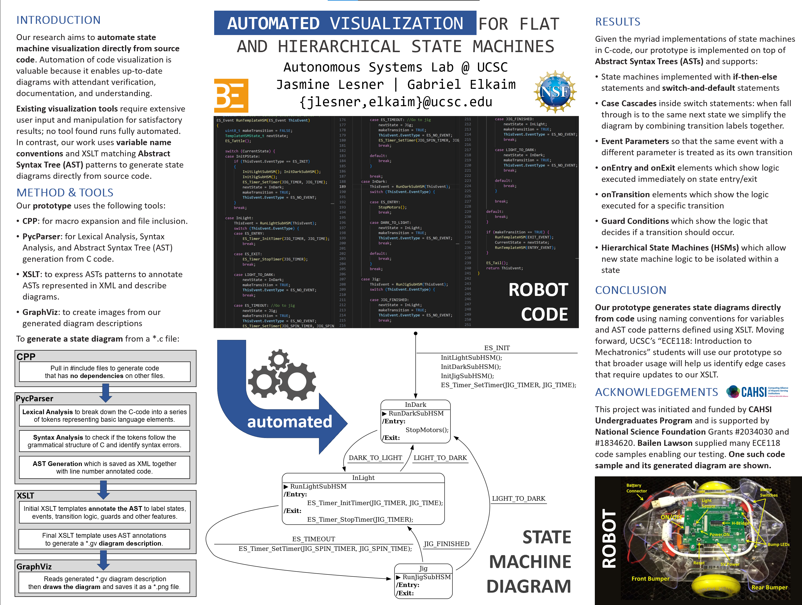

# State Machine Visualizer Setup and Usage Guide

## Overview
The State Machine Visualizer (SMV) is a tool for visualizing the structure and behavior of state machines in your code. Follow these steps to set up and use the tool.

### Step-by-Step Instructions

#### STEP 1: Download the Script
First, download the `smv.bash` script using the following command:
```
wget https://raw.githubusercontent.com/jlesner/smv2/main/smv.bash 
```

#### STEP 2: Script Review and Preparation

Before running the script, it's important to understand its functions:

- **Inspect Changes:** Review the `smv.bash` script to understand the changes it will make. It installs necessary tools like git, curl, and podman if they are not already present on your system.

- **Password Prompt:** The script uses `sudo apt-get`, which might prompt you for your password to install missing tools.

- **First-Time Setup:** On its initial run, `smv.bash` will download the latest version of the State Machine Visualizer and install required dependencies.

- **System Requirements:** The script is designed for Linux systems with the apt package manager, such as Ubuntu. Windows users can use Ubuntu/WSL2, and macOS users might need to run Ubuntu in a VM.

- **Containerization:** To create a suitable environment, `smv.bash` builds a Linux container, installing additional dependencies (Python, Java, etc.) and executes the SMV code within this container. Note that this container requires approximately 900MB of space.

- **Cleanup:** At the end of the script, instructions are provided to remove the installations made by `smv.bash`. These intructions are for when you are done using SMV and want to remove it. Leaving things installed allows  `smv.bash` to run faster. 

#### STEP 3: Running the Script
To run the State Machine Visualizer, use the following command, replacing `${path_to_code}` with the path to your state machine files:
```
bash smv.bash ${path_to_code}
```

#### STEP 4: Viewing the Results
After running the script, you can find the generated `.gv` and `.png` files, which are the visual representations of your state machines, using this command:
```
find ${path_to_code} -name '*.cp5*'
```

By following these steps, you should be able to successfully set up and use the State Machine Visualizer for your projects.
